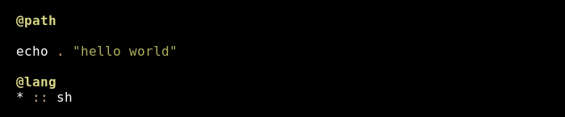
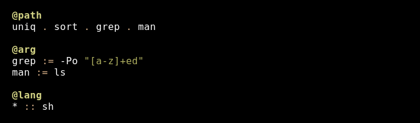
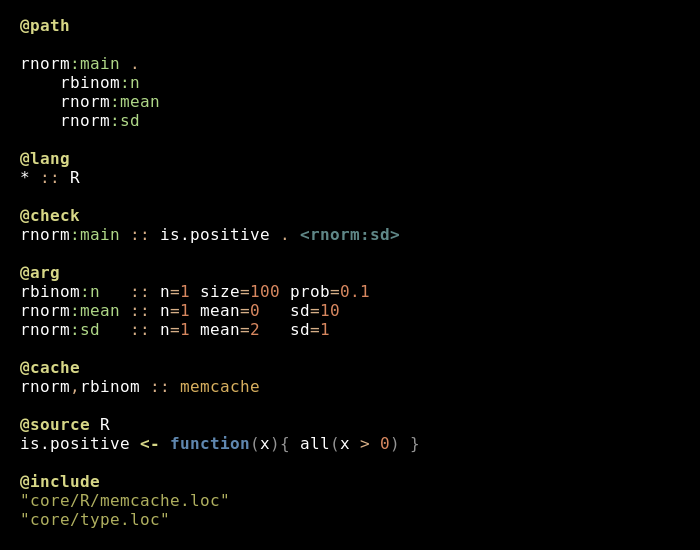
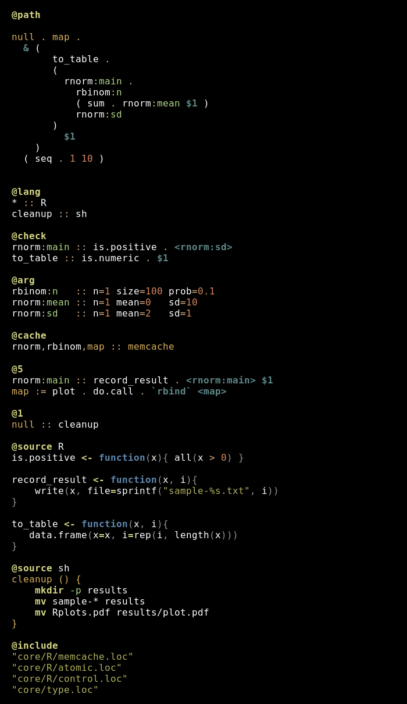
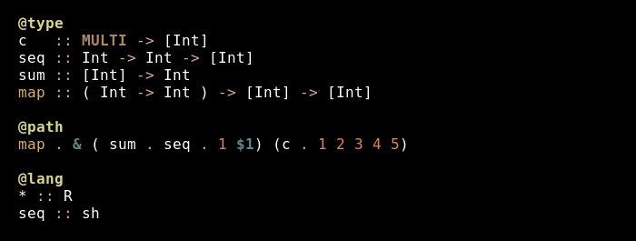

<!-- [](https://travis-ci.org/arendsee/loc) -->
<!-- The travis build fails because their system has a dated bison version -->

Language of Composition
=======================

## Installation

```
git clone https://github.com/arendsee/loc
cd loc
make && make install && make test
```

The `make install` command builds the LOC home (`$HOME/.loc`) where source code
and binaries required for building LOC projects is located (among other
things). It also links the LOC executable (`loc`) to `$HOME/bin`, a folder which
is naively assumed to be in `$PATH`.

To install vim syntax highlighting

```
mkdir -p ~/.vim/syntax/
mkdir -p ~/.vim/ftdetect/
cp vim-syntax/loc.vim ~/.vim/syntax/
echo 'au BufRead,BufNewFile *.loc set filetype=loc' > ~/.vim/ftdetect/loc.vim
```

## Dependencies

 1. bison >=3.0.4
 2. flex
 3. python3

Examples
========

## Hello World



No executable program can be written in pure LOC. There are no print
statements, no conditionals, no variables, no functions, no arithmetic
operators. Rather, programs are composed of functions from other languages. LOC
is a purely metaprogramming language.

The Hello World example above uses the Bash function `echo`, which is given the
input string "Hello World".

LOC scripts are partitioned into sections, each with its own syntax. Only
compositions can be written in the `@path` section. Languages are specified in
the `@lang` section.

To run a LOC script:

```
$ loc hello-world.loc
$ ./manifold-nexus.py main
hello world
```

The LOC frontend first compiles the script into an intermediate language (LOC
Intermediate Language, LIL). The simple language specifies the elements of the
program that will be generated.

```
EMIT  m0  sh
FUNC  m0  echo
INPP  m0  0  "hello world"  *
```

The instruction `EMIT` declares a new "manifold", with id `m0`, that will
contain `sh` (Bash) code. `FUNC` links the function `echo` to `m0` (there may
be multiple manifolds that wrap `echo`, but each will have a unique id). `INPP`
assigns the literal `"hello world"` to the 0th positional argument slot of
`echo`. Ignore the star for now.

The LOC backend translates LIL into executable code. It first builds an
executable, named `manifold-nexus.py` by default, that is the interface to the
LOC program. In this simple hello-world case, it contains the sole command
`main` (much more on this later).

Next it builds a working directory (by default in `.loc/tmp`) where generated
code, temporary files, and caches reside.

For each language used in the LOC script, a file named `call.<lang>` is
created. Each of these files contains a wrapper for each function used in the
LOC script.

For this hello-world program, the following (somewhat simplified) `call.sh`
script is generated

``` bash
#!/usr/bin/env bash

outdir=$HOME/.loc/tmp/loc_0

m0 () {
    echo  "hello world"
}

manifold_exists() {
    type $1 | grep -q function
}

if manifold_exists $1
    $@
else
    exit 1 
fi
```

The `manifold-nexus.py` program passes `m0` to this script when
`./manifold-nexus.py main` is called. It then takes the output of `call.sh m0`
and sends it to the user.

## Composition



The composition in the function above is identical to the shell command:

``` bash
man ls | grep -Po "[a-z]+ed" | sort | uniq
```

Entries in the `@arg` section attach arguments to functions. The composition in
the `@path` section should be as clean and minimal as possible. It should
express the pure and abstract sequence of data transforms at the core of the
analysis. Details, such as parameters, run environments, caching paradigms,
effects, debugging statements, and checking are all implemented in the modifier
sections. So far, I have introduced the `@lang` and `@arg` sections, but there
are many more to come.

Composition in LOC is a bit different from conventional composition in, say,
Haskell. The `.` operator passes the elements on the right as the inputs to any
elements of the left that can take inputs.

This can be a simple chain `h . g . f`. But it can also pass multiple
arguments. For example, in `f . x y z`, the outputs of functions `x`, `y`, and
`z` are passed as the first three positional arguments of `f`. Importantly, it
is not the function `x`, or the manifold that wraps it, that is passed to `f`;
it is the output of `x`.

Here are the legal elements of composition:

 1. manifolds - `h . g . f`
 2. constants - `f . 1 "hello"`
 3. literals - ``f . `foo```
 4. functions - more on this later

Compositions can also be nested to arbitrary depth

```
a . (b . c) (t . r) . z
```

The above could be translated into the following conventional function:

```
a( b(c(z()))), t(r(z())) )
```

## Random random number generator



The above script samples numbers from a normal distribution where all paramters
are in turn sampled from random distributions.

This example introduces several new things.

First of all, I switched to a new language, R. Also I wrote a bit of R source
code (see the `is.positive` function). This code will be passed verbatim to the
`call.R` executable.

A very important part of any non-trivial pipeline is data validation. This is
handled in LOC by entries in the `@check` section. Above I attach a function to
the normal sampler that checks whether the standard deviation (which is drawn
N(2,1) distribution) is positive. If it isn't, no output is printed. The checks
not are limited to accessing the inputs of their parents. Rather, they are free
manifolds that can query any manifolds in the program with the sole restriction
that they return a boolean.

I have also added a cache system, specifying that the outputs of all `rnorm`
and `rbinom` manifolds are stored in memory. I only really need a cache on
`rnorm:sd`, which would otherwise be called twice: once by `rnorm:main` and
once by `is.positive`.

The string following the `:` (e.g. `rnorm:main`) is a label used to resolve
otherwise indistinguishable manifolds. They are not translated into LIL, since
internally all manifolds get unique ids (e.g. `m0`) and are not referred to by
they abstract names. The syntax `<rnorm:sd>` indicates that a specific
manifold (the `rnorm:sd` implicitly declared in the `@path` section) is to be
called, rather than a new `rnorm:sd`.

In the argument section, I am now using named arguments. The `=` is a LOC
operator, it will be translated into the correct language-specific binder by
the frontend.

The code will be translated into the following LIL (skipping included code):

```
NSRC  R

    is.positive <- function(x){ all(x > 0) }

EMIT  m0  R
FUNC  m0  rnorm
INPM  m0  0  m1  *
INPM  m0  1  m2  *
INPM  m0  2  m3  *
CHEK  m0  m4
CACH  m0  memcache
EMIT  m1  R
FUNC  m1  rbinom
CACH  m1  memcache
FARG  m1  0  n  1
FARG  m1  1  size  100
FARG  m1  2  prob  0.1
EMIT  m2  R
FUNC  m2  rnorm
CACH  m2  memcache
FARG  m2  0  n  1
FARG  m2  1  mean  0
FARG  m2  2  sd  10
EMIT  m3  R
FUNC  m3  rnorm
CACH  m3  memcache
FARG  m3  0  n  1
FARG  m3  1  mean  2
FARG  m3  2  sd  1
EMIT  m4  R
FUNC  m4  is.positive
INPM  m4  0  m3  *
```

## Hooks and loops



LOC has no explicit syntax for any control structures. Instead it relies on
high-order functions defined in the source code. The above example demonstrates
the LOC equivalent of a `for` loop. The `&(...)` phrase effectively takes
a composition and transforms it into a function that is passed as an argument
to `map`. Arguments passed into this composition are accessed with `$N` calls.
The `map` function is required to be defined in the source language (it is
imported here with `core/control`).

This script converts the previous random number generator into a function that
is mapped across a sequence of numbers. Note that is uses two language: R and
Bash ('sh').

The rather cryptic `@5` and `@1` sections attach arbitrary code (hooks) to
a manifold.

Below is a template R function with the locations of all 9 possible hooks.

```R
m1 = function (){
    # @0 e.g. m7()
    if(cache_chk("m1")){
        # @8
        b = cache_get("m1")
        # @9
    }
    else{
        # @2
        if( check() ){
            # @4
            b = fun([input], [arg])
            cache_put("m1", b)
            # @5
        } else {
            # @6
            b = fail()
            cache_put("m1", b)
            # @7
        }
        # @3
    }
    # @1
    return b
}
```

If a function is attached to the `@5` slot of a manifold, it will be executed
after the pure function is run but will not be called if a value is taken from
the cache. I use this above to 1) plot the output after the loop and 2) log the
results of each sampling.

`@1` is always called on exit. In the example above, the line

```
@1
null :: cleanup
```

calls the Bash `cleanup` function after the entire program is complete (`null`
is the terminal manifold).

## Types and ontologies



LOC currently supports simple types. The syntax is nearly identical to Haskell,
with the addition of two keywords: `?` and `void`. `?` matches any number of
inputs of any type. `void` implies no output (if on the right) or input (if on
the left).

LOC does not yet support generic types, type constructors, algebraic types and
all that. But it will in the future.

Types are important for several reasons.

First, typechecking can catch incorrect connections at compile time. Indeed,
a fully typed workflow can be proven to be correct at a high level, assuming of
course the the user has correctly entered the type (unlike Haskell, LOC cannot
typecheck "all the way down").

Also, the type signatures are a formal documentation succinctly describing the
behaviour of a function.

In the context of LOC, however, the greatest value of types is that
a well-desiged type system can transcend language barriers. Two functions with
the same signature can, in theory, be swapped without altering the correctness
of the pipeline (at the type level), regardless of their language. 

LOC distinguishes between "universal" and "native" forms of data. Calls between
manifolds of the same language, can transfer data using native data structures,
as they would in a conventional program. However, foreign calls require the
data is first transformed to a "universal" form, passed to the foreign
language, and then transformed into the foreign "native" form. Types direct
these transforms.
