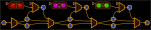

<p align="center">
  <a href="https://github.com/morloc-project/morloc/releases"></a>&nbsp;&nbsp;
  <a href="https://www.apache.org/licenses/LICENSE-2.0"></a>&nbsp;&nbsp;
  <a href="https://morloc-project.github.io/docs"></a>&nbsp;&nbsp;
  <a href="https://discord.gg/dyhKd9sJfF"></a>&nbsp;&nbsp;
  <a href="https://peerj.com/articles/cs-3435/"></a>&nbsp;&nbsp;
  <a href="https://x.com/morlocproject"></a>&nbsp;&nbsp;
  <a href="https://bsky.app/profile/morloc-project.bsky.social"></a>&nbsp;&nbsp;
  <a href="mailto:z@morloc.io"></a>
</p>

<p align="center">
  
</p>

<div align="center">
<h1>Morloc</h1>
<h2>the function is the unit, not the application</h2>
</div>

Morloc is a typed language for composing functions written in other languages.

You write ordinary code in an ordinary language and give it a type. From that
one type the compiler derives the command line interface, the network API, the
MCP tool description a model reads, the wire format, and the argument parser --
and it checks every boundary those cross before anything runs. The interface is
not a convention an author remembered to follow. It is a consequence of a
declaration.

Because Morloc types are language-neutral, the implementation behind a type may
come from any supported language, or from a composition of functions written in
several. The compiler generates the code that carries data between them.

**[Read the manual](https://morloc-project.github.io/docs)** -- it is the real
documentation, and everything below is a sample of it.

## An example

Two functions, in two languages, neither aware of the other. A C++ sum:

```cpp
// foo.hpp
#pragma once
#include <vector>

double sum(const std::vector<double>& vec) {
    double sum = 0.0;
    for (double value : vec) {
        sum += value;
    }
    return sum;
}
```

and a parallel map in Python:

```python
# foo.py
import multiprocessing as mp

def pmap(f, xs):
    with mp.Pool() as pool:
        results = pool.map(f, xs)
    return results
```

Neither file imports anything from Morloc. The Morloc module gives each a type
and composes them:

```morloc
-- sums.loc
module m (sum, sumOfSums)

import root-py
import root-cpp

source Py from "foo.py" ("pmap")
source Cpp from "foo.hpp" ("sum")

pmap :: (a -> b) -> [a] -> [b]

--' Add up a list of numbers
sum :: [Real] -> Real

--' Add up a list of lists, summing each in parallel
sumOfSums :: [[Real]] -> Real
sumOfSums = sum . pmap sum
```

`.` is function composition, so `sumOfSums` reads right to left: `pmap sum` sums
each inner list in parallel, and the outer `sum` adds the results.

```console
$ morloc make sums.loc
$ ./sums sumOfSums '[[1,2],[3,4,5]]'
15
```

A Python function called a C++ function across a process boundary, and you
wrote no binding, no serializer, and no argument parser.

### What that one type also bought you

The same build is a command line tool, with help written from your types and
docstrings:

```console
$ ./sums -h
Usage: ./sums <nexus_options> <command> <command_options>

Commands:
  sum        Add up a list of numbers
  sumOfSums  Add up a list of lists, summing each in parallel

General Options:
  -h, --help  Print help (see more with '--help')
```

`./sums sum -h` goes further and prints the argument types the compiler derived.

It is also an MCP server (`./sums --mcp-tools` emits JSON Schema tool
definitions), an HTTP, TCP, and Unix-socket service, and a module that another
Morloc module can import and re-export. None of these is a separate build or a
separate description, so none of them can drift from the functions: change a
return type and every one of them moves on the next build.

## Install

Morloc runs natively on Linux and Apple Silicon macOS. On Windows, use
[WSL](https://learn.microsoft.com/en-us/windows/wsl/about) and follow the Linux
instructions inside it.

Everything is installed and managed by `mim`, the Morloc installation manager:

```sh
curl -fsSL https://raw.githubusercontent.com/morloc-project/morloc-manager/main/scripts/install.sh | sh
```

This drops a single static binary into `~/.local/bin` (no `sudo`, no changes to
your shell startup files). If that directory is not on your `PATH`, the
installer prints the command to add it.

Then create an environment -- a self-contained Morloc installation with its own
solved toolchain -- and enter it:

```sh
mim new      # first run takes a few minutes
mim shell
```

This builds natively on your host without installing anything system-wide. To
keep Morloc inside a container instead, pass `mim new --engine docker` (podman
and apptainer are also supported).

Inside the shell, `morloc` is on your `PATH`. No language toolchain is installed
up front; Python, C++, R, and Rust are provisioned on demand the first time you
build a program that uses them, and imported modules are fetched automatically
at versions compatible with your compiler.

Now paste the three files above into a directory and run `morloc make sums.loc`.

The manual covers all of this in more detail, including the container backends,
NixOS, corporate CA bundles, and what to do when something fails:
[Getting Started](https://morloc-project.github.io/docs/#_getting_started).

## Learn Morloc

The [manual](https://morloc-project.github.io/docs) is written to be read front
to back, and it is where I point everyone. Some places to jump in:

- [Getting Started](https://morloc-project.github.io/docs/#_getting_started) --
  install, first program, and the same example built up one step at a time
- [Building CLIs](https://morloc-project.github.io/docs/#building-clis) --
  arguments, stdin, output formats, streaming, and composing tools into toolboxes
- [Building APIs](https://morloc-project.github.io/docs/#building-apis) --
  the same library served over HTTP, sockets, and MCP
- [Language Support](https://morloc-project.github.io/docs/#_language_support)
  -- what each of Python, C++, R, Rust, and Futhark can do today
- [Modules and Libraries](https://morloc-project.github.io/docs/#_modules_and_libraries)
  -- writing and publishing your own

The [paper](https://peerj.com/articles/cs-3435/) (PeerJ Computer Science) makes
the case for Morloc against conventional scientific workflows.

## Where the project stands

Morloc has been in development for about ten years and is in beta. I use it for
my own work; it is not yet used widely by anyone else.

Solid: the compiler and its type system, Python/C++/R as fully supported
languages, the generated CLI, HTTP, socket and MCP interfaces, environment and
dependency management through `mim`, and a standard library covering the common
data structures, text, math, tables, and tensors.

Thin or unfinished: library coverage far from complete, remote execution (the
SLURM dispatch that makes Morloc usable as a cluster workflow language) is in
development, editor support is current for vim and Pygments and stale for VS
Code/Zed, some aspects of the type system are still experimental, and the module
registry is unbuilt.

You will hit sharp edges. That is what the
[issue tracker](https://github.com/morloc-project/morloc/issues) is for.

## Getting involved

The hard part is finished. The library is nearly empty -- outside
[morloclib](https://github.com/morloclib) there is barely an ecosystem at all,
and a compiler cannot generate one. That is where I need people:

- **Write a module.** Take something you already maintain, give it types, and
  publish it.
- **Report what breaks.** A bug report is worth more to me than a patch right
  now. Unexpected behavior, a bad error message, a gap in the manual, and
  anything harder than it should have been all count.
- **Fix the editor tooling.** Add support for your favorite editor.
- **Bring a language.** Every new language brings fun design questions, I would
  be happy to work with you in bringing your language into the Morloc ecosystem.
- **Tell me the right way to build a type system.** There is a lot of theory to
  hash through and I've half-assed more than half of it. If you're a theorist,
  I'd love to hear from you. There's a paper or two buried somewhere in all of
  this.

If you are interested in playing with Morloc (or want to drown my in money),
feel free to contact me at [z@morloc.io](z@morloc.io).

## License

Apache 2.0. See [LICENSE](LICENSE).
